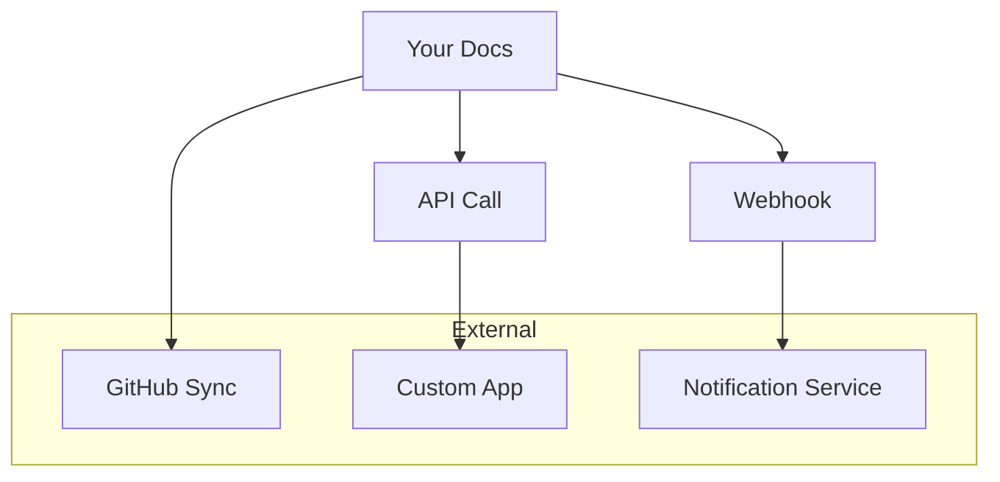

## Overview

Extend your Stephen Robles documentation space by integrating with popular tools. Sync content with GitHub for version control, use the API for custom applications, set up webhooks for real-time notifications, and embed external sources to enrich your pages.

<Callout kind="info">
These integrations require an active account. Generate your `{API_KEY}` from the dashboard settings first.
</Callout>

<Columns cols={2}>
  <Card title="GitHub Sync" icon="github" href="#github-sync">
    Keep your docs in sync with GitHub repositories automatically.
  </Card>
  <Card title="API Access" icon="api" href="#api-access">
    Build custom tools using RESTful API endpoints.
  </Card>
  <Card title="Webhooks" icon="zap" href="#webhooks">
    Receive instant updates on doc changes via webhooks.
  </Card>
  <Card title="Embed Content" icon="link" href="#embed-content">
    Pull in live data from external services.
  </Card>
</Columns>

## GitHub and Version Control Sync

Connect your documentation space to GitHub for seamless version control. Push changes directly from your repo or pull updates into your docs.

<Steps>
  <Step title="Connect Repository" icon="github">
    Navigate to Settings > Integrations in your dashboard.
    
    Select GitHub and authorize the app.
  </Step>
  <Step title="Configure Sync" icon="settings">
    Choose your repository and branch (e.g., `main`).
    
    Enable auto-sync for pushes and pulls.
  </Step>
  <Step title="Test Integration" icon="check-circle">
    Make a commit in GitHub and verify it appears in your docs.
  </Step>
</Steps>

<Callout kind="tip">
Use branch protection rules in GitHub to prevent accidental overwrites.
</Callout>

## API Access for Custom Integrations

Access your documentation programmatically via REST API at `https://api.example.com/v1`.

<ParamField path="docs/{doc_id}" param-type="GET" required="true">
  Retrieve a specific document by ID.
</ParamField>

<ParamField header="Authorization" param-type="string" required="true">
  Bearer `{YOUR_API_KEY}`.
</ParamField>

<CodeGroup tabs="JavaScript,Python">
  ```javascript
  const response = await fetch('https://api.example.com/v1/docs/123', {
    headers: {
      'Authorization': 'Bearer YOUR_API_KEY'
    }
  });
  const doc = await response.json();
  console.log(doc);
  ```
  ```python
  import requests
  
  headers = {'Authorization': 'Bearer YOUR_API_KEY'}
  response = requests.get('https://api.example.com/v1/docs/123', headers=headers)
  doc = response.json()
  print(doc)
  ```
</CodeGroup>

## Webhook Setup for Notifications

Set up webhooks to receive events like doc updates or new publishes.

### Create Webhook

1. Go to Settings > Webhooks.
2. Add your endpoint URL (e.g., `https://your-webhook-url.com/webhook`).
3. Select events: `doc.updated`, `doc.published`.

<Tabs>
  <Tab title="Node.js Handler" icon="nodejs">
    ```javascript
    const express = require('express');
    const app = express();
    
    app.post('/webhook', express.json(), (req, res) => {
      console.log('Event:', req.body.event);
      console.log('Doc ID:', req.body.data.id);
      res.status(200).send('OK');
    });
    
    app.listen(3000);
    ```
  </Tab>
  <Tab title="Python Flask" icon="python">
    ```python
    from flask import Flask, request
    
    app = Flask(__name__)
    
    @app.route('/webhook', methods=['POST'])
    def webhook():
        data = request.json
        print(f"Event: {data['event']}")
        print(f"Doc ID: {data['data']['id']}")
        return 'OK', 200
    ```
  </Tab>
</Tabs>

## Embedding External Content Sources

Embed live content from tools like GitHub Gists, YouTube, or custom iframes.

<Expandable title="Advanced Embedding Options" default-open="false">
Use iframes for secure embeds:

```html
<iframe src="https://your-embed-source.com" width="100%" height="400"></iframe>
```

Ensure sources support embedding and review CORS policies.
</Expandable>



These integrations streamline your workflow. Start with GitHub sync for immediate value, then explore APIs for deeper customization.